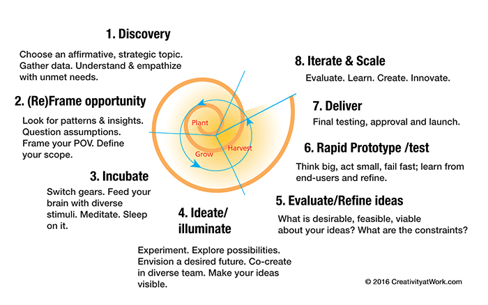

*Although the theme sets the general tone of the conference, it doesn't
preclude session topics that might be considered "off theme." The goal
of the theme is to stimulate ideas, not to prevent discussion.*

Applying Design Thinking
------------------------
[Design Thinking](http://www.creativityatwork.com/design-thinking-strategy-for-innovation/)
is a process of focused problem-solving through creative thinking and experimentation:
 
(Image used by permission from [Creativity at Work](http://www.creativityatwork.com))

**Potential Topics:**

-   Using new tools to solve old problems
-   Designing for simplicity: understandable is maintainable
-   Reconsidering agile timeboxing
-   Exploring the potential of cross-language development
-   Discovering ineffective patterns
-   Breaking out of our mental and cultural chains
-   Accepting that big shifts might take time
-   Can we take the interview out of the job interview?
-   Re-envisioning how we recruit, onboard, and build teams
-   And lots more
-   Plus anything else anyone wants to talk about, of course
-   And our business track
